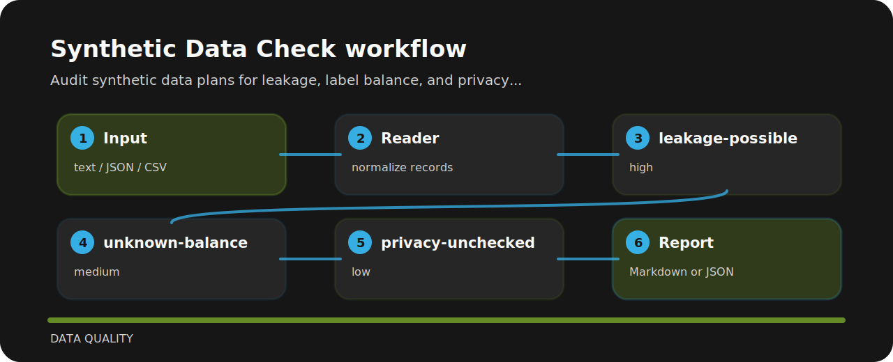

# Synthetic Data Check

| Field | Value |
| --- | --- |
| Area | data quality |
| Command | `synthetic-data-check` |
| Example | `examples/sample.txt` |


Audit synthetic data plans for leakage, label balance, and privacy claims. It keeps the review small: one input file, a short list of findings, and enough context to fix the line that caused the warning.

## What gets flagged

- `leakage-possible` - synthetic data leakage risk (high); run nearest-neighbor and privacy checks.
- `unknown-balance` - class balance unclear (medium); report label distribution.
- `privacy-unchecked` - privacy checks missing (low); document privacy validation.

## Policy flow



## Run the sample

```bash
git clone https://github.com/mertefekurt/synthetic-data-check.git
cd synthetic-data-check
python -m pip install -e ".[dev]"
synthetic-data-check examples/sample.txt
```
